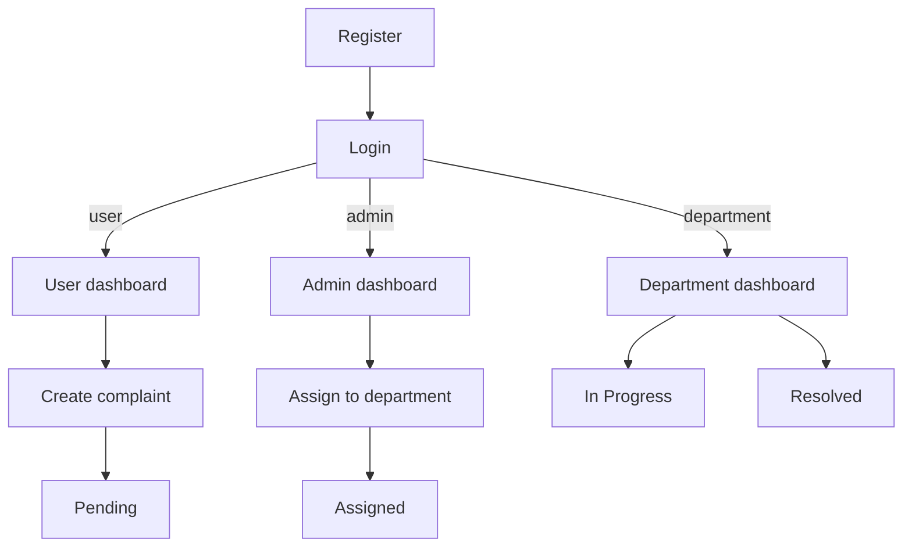

<div align="center">


# 📋 Complaint Management System

### *A role-based complaint tracking web application*

<br/>


<br/>


</div>

---

## 📌 Table of Contents

- [About the Project](#-about-the-project)
- [Features](#-features)
- [Pages / Routes](#-pages--routes)
- [User Roles](#-user-roles)
- [Roles Flow](#-roles-flow)
- [Project Structure](#-project-structure)
- [Tech Stack](#-tech-stack)
- [Getting Started](#-getting-started)
- [Database Setup](#-database-setup)
- [Troubleshooting](#-troubleshooting)
- [Contributing](#-contributing)

---

## 🧾 About the Project

> 🎯 **Complaint Management System** is a full-stack web application that provides an organized platform for users to **submit complaints**, departments to **resolve them**, and admins to **oversee the entire process** — all from a clean, role-based dashboard.

This project was built as a **college mini-project** to demonstrate multi-role authentication, CRUD operations, and department-based complaint routing using **vanilla PHP + MySQL** — no heavy frameworks, just clean fundamentals.

Whether you're a student, institution, or organization — this system helps bridge the gap between complaint-raiser and resolver. 🚀

---

## ✨ Features

| Feature | Status |
|---|---|
| 🔐 User Registration & Login | ✅ Done |
| 👤 Role-based Authentication (Admin / User / Department) | ✅ Done |
| 📝 Complaint Submission (title + description) | ✅ Done |
| 🏢 Department accounts created by admin | ✅ Done |
| 📌 Admin assignment to departments | ✅ Done |
| ✅ Status tracking (`Pending` → `Assigned` → `In Progress` → `Resolved`) | ✅ Done |
| 🔒 Secure passwords (`password_hash` / `password_verify`) | ✅ Done |
| 📊 Analytics dashboard | ⏳ Not implemented |
| 📧 Email notifications | ⏳ Not implemented |

---

## 🧭 Pages / Routes

| What | Where |
|---|---|
| Login (Admin/User) | `login.php` |
| Register | `register.php` |
| Department login | `department/login.php` |
| User dashboard | `user/dashboard.php` |
| Add complaint | `user/add_complaint.php` |
| View complaint | `user/view_complaint.php?id=...` |
| Admin dashboard | `admin/dashboard.php` |
| Create department account | `admin/create_department.php` |
| Assign complaint | `admin/assign.php?id=...` |
| Department dashboard | `department/dashboard.php` |
| Update status | `department/update_status.php?id=...` |
| Logout | `auth/logout.php` |

---

## 👥 User Roles

The system has **three distinct roles**, each with its own dashboard and access level:

### 🙋 User
- Register and log in to the system
- Submit new complaints (title + description)
- Track the status of submitted complaints
- View complaint history

### 🏢 Department
- Log in from `department/login.php`
- View complaints assigned to the department
- Update complaint status (`In Progress` or `Resolved`)

### 🛡️ Admin
- Full system oversight from a central dashboard
- Create department accounts
- Assign complaints to departments

> Note: The first account registered becomes `admin` automatically.

---

## 🔁 Roles Flow




---

## 🗂️ Project Structure

```
complaint-system/
├── admin/                  # Admin dashboard & assignment pages
├── assets/css/             # Shared stylesheets
├── auth/                   # Login/register processors + logout
├── config/                 # DB connection + helpers
├── department/             # Department login/dashboard/status update
├── user/                   # User dashboard + complaint create/view
├── login.php               # Main login page (admin/user)
├── register.php            # Registration page
├── login.css
├── register.css
└── README.md
```

---

## 🛠️ Tech Stack

| Layer | Technology |
|---|---|
| 🖥️ Frontend | HTML5, CSS3, Vanilla JavaScript |
| ⚙️ Backend | PHP (vanilla, no framework) |
| 🗄️ Database | MySQL |
| 🔗 Communication | Fetch API (AJAX) |
| 🎨 Styling | Custom CSS |

---

## 🚀 Getting Started

### Prerequisites

Make sure you have the following installed:

-  **XAMPP** (or any local server with PHP + MySQL)
- A browser (Chrome, Firefox, etc.)
- Git

---

### 🧰 Installation

**1. Get the project**

```bash
# Option A: clone
git clone <your-repo-url> complaint-system

# Option B: download ZIP and extract as "complaint-system"
```

**2. Move it into your web server root**

```bash
# For XAMPP on Windows
cp -r complaint-system C:/xampp/htdocs/

# For XAMPP on Linux/Mac
cp -r complaint-system /opt/lampp/htdocs/
```

**3. Start Apache & MySQL** from the XAMPP Control Panel

**4. Set up the database** (see [Database Setup](#-database-setup) below)

**5. Configure the DB connection**

Open `config/db.php` and update if needed:

```php
<?php
$conn = mysqli_connect("localhost", "root", "", "complaint_system");

if (!$conn) {
    die("Connection failed: " . mysqli_connect_error());
}

return $conn;
```

**6. Open the app in your browser**

```
http://localhost/complaint-system/login.php
```

---

## 🗄️ Database Setup

### 1) Create the database

Create a MySQL database named `complaint_system`.

### 2) Create tables (baseline)

This repo doesn’t include an SQL dump yet. Use this as a baseline and adjust as needed.

<details>
    <summary><b>Show baseline SQL</b></summary>

```sql
CREATE DATABASE IF NOT EXISTS complaint_system;
USE complaint_system;

CREATE TABLE IF NOT EXISTS users (
    id INT AUTO_INCREMENT PRIMARY KEY,
    name VARCHAR(100) NOT NULL,
    email VARCHAR(150) NOT NULL UNIQUE,
    password VARCHAR(255) NOT NULL,
    role ENUM('admin','user','department') NOT NULL DEFAULT 'user'
);

CREATE TABLE IF NOT EXISTS departments (
    id INT AUTO_INCREMENT PRIMARY KEY,
    name VARCHAR(100) NOT NULL UNIQUE,
    user_id INT NULL
);

CREATE TABLE IF NOT EXISTS complaints (
    id INT AUTO_INCREMENT PRIMARY KEY,
    user_id INT NOT NULL,
    department_id INT NULL,
    title VARCHAR(200) NOT NULL,
    description TEXT NOT NULL,
    status VARCHAR(30) NOT NULL DEFAULT 'Pending',
    created_at TIMESTAMP NOT NULL DEFAULT CURRENT_TIMESTAMP
);
```

</details>

### 3) Department linking behavior (important)

In `config/department_helper.php`, the app checks whether `departments.user_id` exists:

- If it exists, departments are linked by `user_id`.
- If it does not exist, departments are linked by matching department user `name` to `departments.name`.

### 4) First admin account

The first account registered (via `register.php`) becomes `admin` automatically.

---

## 🧰 Troubleshooting

<details>
    <summary><b>Department login shows “department_not_linked”</b></summary>

- Create the department via the admin panel (`admin/create_department.php`).
- Ensure there’s a matching row in `departments`.

</details>

<details>
    <summary><b>Database connection failed</b></summary>

- Make sure MySQL is running (XAMPP Control Panel).
- Double-check credentials in `config/db.php`.
- Confirm the DB is named `complaint_system`.

</details>

---

## 🤝 Contributing

Contributions are **always welcome**! Here's how you can help:

```bash
# 1. Fork the project
# 2. Create your feature branch
git checkout -b feature/AmazingFeature

# 3. Commit your changes
git commit -m "feat: add AmazingFeature"

# 4. Push to the branch
git push origin feature/AmazingFeature

# 5. Open a Pull Request 🎉
```

### 💡 Ideas for Contributions

- [ ] Add an SQL dump file to the repo (one-click setup)
- [ ] Add complaint filtering/search on dashboards
- [ ] Add better status history / timeline
- [ ] Add email notifications on status change
- [ ] Add analytics (counts by status/department)
