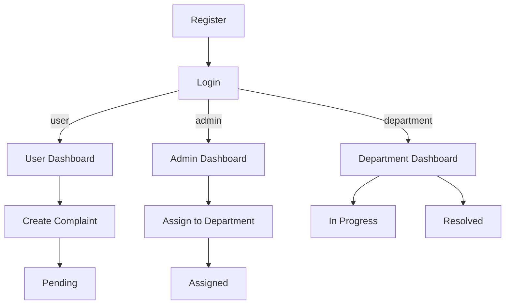

<div align="center">


# Complaint Management System

A role-based complaint tracking web application built with **PHP + MySQL**.


</div>

---

## 📌 Table of Contents

- [✨ Features](#-features)
- [🧭 Pages / Routes](#-pages--routes)
- [👥 Roles](#-roles)
- [🔁 Flow](#-flow)
- [🚀 Local Setup (XAMPP)](#-local-setup-xampp)
- [🗄️ Database Setup](#%EF%B8%8F-database-setup)
- [🧩 Project Structure](#-project-structure)
- [🧰 Troubleshooting](#-troubleshooting)

---

## ✨ Features

- User registration + login
- Role-based access: **Admin / User / Department**
- Users can submit complaints and track status
- Admin can create department accounts and assign complaints
- Departments can update complaint status (`In Progress`, `Resolved`)

---

## 🧭 Pages / Routes

| What | Path |
|---|---|
| Login (Admin/User) | `login.php` |
| Register | `register.php` |
| Department login | `department/login.php` |
| User dashboard | `user/dashboard.php` |
| Add complaint | `user/add_complaint.php` |
| View complaint | `user/view_complaint.php?id=...` |
| Admin dashboard | `admin/dashboard.php` |
| Create department account | `admin/create_department.php` |
| Assign complaint | `admin/assign.php?id=...` → `admin/assign_department.php` |
| Department dashboard | `department/dashboard.php` |
| Update status | `department/update_status.php?id=...` → `department/update_status_process.php` |
| Logout | `auth/logout.php` |

---

## 👥 Roles

<details open>
  <summary><b>🙋 User</b></summary>

- Register/login
- Create complaints (title + description)
- Track status and view details

</details>

<details>
  <summary><b>🏢 Department</b></summary>

- Login from `department/login.php`
- View assigned complaints
- Update status to `In Progress` or `Resolved`

</details>

<details>
  <summary><b>🛡️ Admin</b></summary>

- View all complaints
- Create department accounts
- Assign complaints to departments

</details>

> First-time note: the **first registered account becomes Admin** automatically.

---

## 🔁 Flow



---

## 🚀 Local Setup (XAMPP)

1. Install XAMPP and start **Apache** + **MySQL**.
2. Put this project folder into:
   - `C:\\xampp\\htdocs\\complaint-system`
3. Create a MySQL database named: `complaint_system`
4. Open in browser:
   - `http://localhost/complaint-system/login.php`

---

## 🗄️ Database Setup

### Connection

Edit `config/db.php` to match your MySQL credentials.

### Baseline schema

This repo doesn’t include an `.sql` file yet. Use this baseline to create tables.

<details>
  <summary><b>Show baseline SQL</b></summary>

```sql
CREATE DATABASE IF NOT EXISTS complaint_system;
USE complaint_system;

CREATE TABLE IF NOT EXISTS users (
  id INT AUTO_INCREMENT PRIMARY KEY,
  name VARCHAR(100) NOT NULL,
  email VARCHAR(150) NOT NULL UNIQUE,
  password VARCHAR(255) NOT NULL,
  role ENUM('admin','user','department') NOT NULL DEFAULT 'user'
);

CREATE TABLE IF NOT EXISTS departments (
  id INT AUTO_INCREMENT PRIMARY KEY,
  name VARCHAR(100) NOT NULL UNIQUE,
  user_id INT NULL
);

CREATE TABLE IF NOT EXISTS complaints (
  id INT AUTO_INCREMENT PRIMARY KEY,
  user_id INT NOT NULL,
  department_id INT NULL,
  title VARCHAR(200) NOT NULL,
  description TEXT NOT NULL,
  status VARCHAR(30) NOT NULL DEFAULT 'Pending',
  created_at TIMESTAMP NOT NULL DEFAULT CURRENT_TIMESTAMP
);
```

</details>

### Department linking behavior

The app supports two ways to link department accounts:

- If `departments.user_id` exists, it links by `user_id`.
- Otherwise it links by matching `departments.name` with the department user `name`.

---

## 🧩 Project Structure

```text
complaint-system/
├─ admin/
├─ assets/css/
├─ auth/
├─ config/
├─ department/
├─ user/
├─ login.php
├─ register.php
└─ README.md
```

---

## 🧰 Troubleshooting

<details>
  <summary><b>PHP shows syntax errors with &lt;&lt;&lt;&lt;&lt;&lt;&lt; markers</b></summary>

That means a Git merge conflict is unresolved. Remove the conflict markers or re-run the merge and resolve conflicts.

</details>

<details>
  <summary><b>Department login shows "department_not_linked"</b></summary>

Create the department via `admin/create_department.php`, then login again.

</details>

<details>
  <summary><b>Database connection failed</b></summary>

- Confirm MySQL is running in XAMPP.
- Check credentials in `config/db.php`.
- Ensure the database name is `complaint_system`.

</details>
