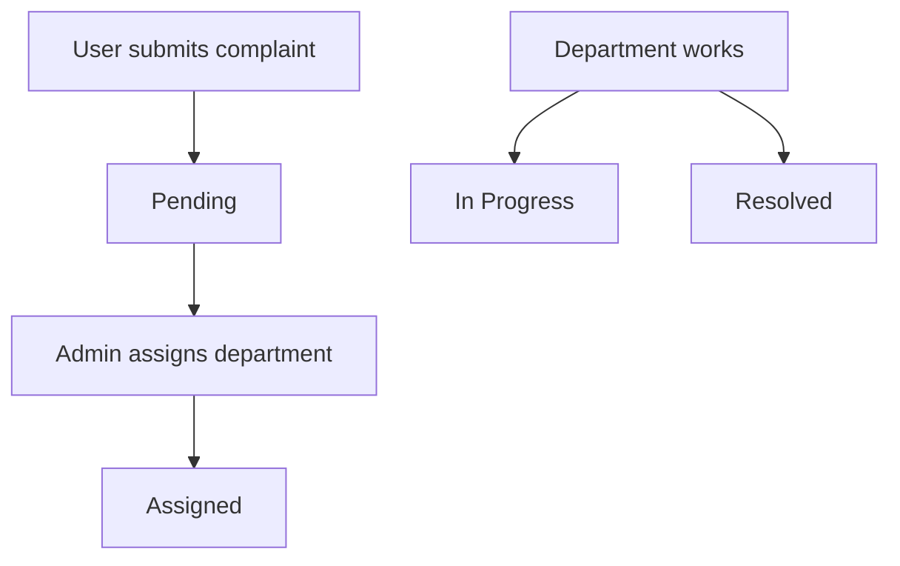

<div align="center">


# Complaint Management System

Role-based complaint tracking web app built with **PHP + MySQL**.


</div>

---

## Table of Contents

- [Overview](#overview)
- [Tech Stack](#tech-stack)
- [Features](#features)
- [Roles & Capabilities](#roles--capabilities)
- [Pages / Routes](#pages--routes)
- [Complaint Status Flow](#complaint-status-flow)
- [Local Setup (XAMPP)](#local-setup-xampp)
- [Database Setup](#database-setup)
- [Project Structure](#project-structure)
- [Troubleshooting](#troubleshooting)

---

## Overview

This project is a simple complaint management system with **Admin**, **User**, and **Department** roles.  
Users submit complaints, admins assign them to departments, and departments update the status.

> First-time note: the **first registered account becomes Admin** automatically.

---

## Tech Stack

- **PHP 8.x** (server-side)
- **MySQL 8.x** (database)
- **HTML / CSS / JavaScript** (UI)
- **XAMPP** (recommended local stack)

---

## Features

- User registration & login
- Role-based dashboards
- Submit complaints with title + description
- Admin creates department accounts and assigns complaints
- Department updates status to **In Progress** or **Resolved**
- Session-based access control + hashed passwords

---

## Roles & Capabilities

### 🙋 User
- Register / login
- Create complaints
- Track complaint status and details

### 🛡️ Admin
- View all complaints
- Create department accounts
- Assign complaints to departments

### 🏢 Department
- Login from `department/login.php`
- View assigned complaints
- Update complaint status

---

## Pages / Routes

| Purpose | Path |
|---|---|
| Login (Admin/User) | `login.php` |
| Register | `register.php` |
| Department login | `department/login.php` |
| User dashboard | `user/dashboard.php` |
| Add complaint | `user/add_complaint.php` |
| View complaint | `user/view_complaint.php?id=...` |
| Admin dashboard | `admin/dashboard.php` |
| Create department account | `admin/create_department.php` |
| Assign complaint | `admin/assign.php?id=...` → `admin/assign_department.php` |
| Department dashboard | `department/dashboard.php` |
| Update status | `department/update_status.php?id=...` → `department/update_status_process.php` |
| Logout | `auth/logout.php` |

---

## Complaint Status Flow



---

## Local Setup (XAMPP)

1. Install **XAMPP** and start **Apache** + **MySQL**.
2. Place this project in:
   - `C:\\xampp\\htdocs\\complaint-system`
3. Create a MySQL database named: `complaint_system`.
4. Update credentials in `config/db.php`.
5. Open in browser:
   - `http://localhost/complaint-system/login.php`

---

## Database Setup

### Connection

Edit `config/db.php` to match your MySQL credentials.

### Baseline schema

```sql
CREATE DATABASE IF NOT EXISTS complaint_system;
USE complaint_system;

CREATE TABLE IF NOT EXISTS users (
  id INT AUTO_INCREMENT PRIMARY KEY,
  name VARCHAR(100) NOT NULL,
  email VARCHAR(150) NOT NULL UNIQUE,
  password VARCHAR(255) NOT NULL,
  role ENUM('admin','user','department') NOT NULL DEFAULT 'user'
);

CREATE TABLE IF NOT EXISTS departments (
  id INT AUTO_INCREMENT PRIMARY KEY,
  name VARCHAR(100) NOT NULL UNIQUE,
  user_id INT NULL
);

CREATE TABLE IF NOT EXISTS complaints (
  id INT AUTO_INCREMENT PRIMARY KEY,
  user_id INT NOT NULL,
  department_id INT NULL,
  title VARCHAR(200) NOT NULL,
  description TEXT NOT NULL,
  status VARCHAR(30) NOT NULL DEFAULT 'Pending',
  created_at TIMESTAMP NOT NULL DEFAULT CURRENT_TIMESTAMP
);
```

### Department linking behavior

The app supports two linking modes:

- If `departments.user_id` exists, it links by `user_id`.
- Otherwise it links by matching `departments.name` to the department user `name`.

---

## Project Structure

```text
complain_system_project/
├─ admin/
├─ assets/
│  └─ css/
├─ auth/
├─ config/
├─ department/
├─ user/
├─ login.php
├─ register.php
└─ README.md
```

---

## Troubleshooting

<details>
  <summary><b>Department login shows "department_not_linked"</b></summary>

Create the department via `admin/create_department.php`, then login again.
</details>

<details>
  <summary><b>Database connection failed</b></summary>

- Confirm MySQL is running in XAMPP.
- Check credentials in `config/db.php`.
- Ensure the database name is `complaint_system`.
</details>
